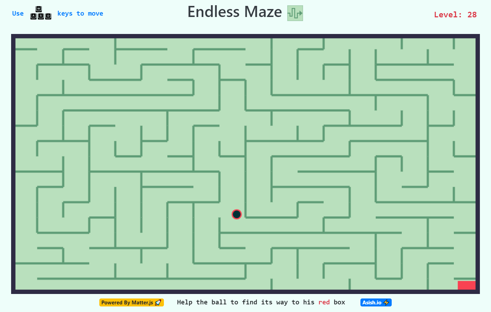

# Endless Maze 🎮
   

 ### Check it out [here]!
## Overview 👀

### Browser based game that generates Maze on the fly with never ending levels and incresed complexity in each level
- **WASD Controls 🕹**
- **Endless Levels 😵**
- **Increasing Complexity with each level 😲**

## Role of [Matter.js] 🤔

- This library helps in handling all the canvas manipulation which would be more difficult to do with default methods

- One good thing about this library is providing collisions by defaults to every body created in the game world and does most of the heavy lifting for the detection

- one thing to remember is **`Simulating Physics in computational world is very hard`** and [Matter.js] does a pretty good job coming very close to real physics 

## WIP 🛠
- Mobile Version (making html canvas responsive is nightmare 😖)

## Sidenote 📄
- The reason i stated [Matter.js] very close to real physics is due to its problem of not having CCD (Continous collision detection) built to its core, which tends to famous physics phenomenon **`Tunnelling`** where a body accquires enough velocity that it can pass through the rigid bodies.
- This can be seen sometimes during gameplay of **Endless-Maze** when user does long press for  a movement key, the velocity keeps adding to the ball and eventually pass through the walls.

- I have done some workaround to this problem which minimizes the velocity in a nasty way, it dosen't totally removes this problem but somewhat reduces it.  

- This issue cant be resolved until **CCD** is built into **Matter.js**

- On more info on how **CCD** solves this problem [visit here] 

## How To Contribute🤝 
#### I would recommend you to get familar with the `test\index2.js` before you start learning the maze generation algorithm and also a piror knowledge on `Matter.js` should be necessary in order to understand the logic code

### Matter.js [Tutorial]/[Documentaion]
`whole project took ~16hr to complete from learn to deploy`

- Yes,it is open source you can clone and change code to your need.
- Most of the code is self explanatory, anyhow
- for any clarification on code or want to contribute contact 
- [Gmail] / [Twitter] /[LinkedIn]

[visit here]:<http://www.stencyl.com/help/view/continuous-collision-detection/>
[Gmail]: <mailto:vashish888@gmail.com>
[LinkedIn]: <https://www.linkedin.com/in/asish-raju-7a0b90192>
[Twitter]: <https://twitter.com/vashish888>
[here]:<https://asishraju.github.io/Endless-Maze/>
[Matter.js]:<https://brm.io/matter-js/>
[Tutorial]:<https://www.youtube.com/playlist?list=PLRqwX-V7Uu6bLh3T_4wtrmVHOrOEM1ig_>
[Documentaion]:<https://brm.io/matter-js/docs/>

 
